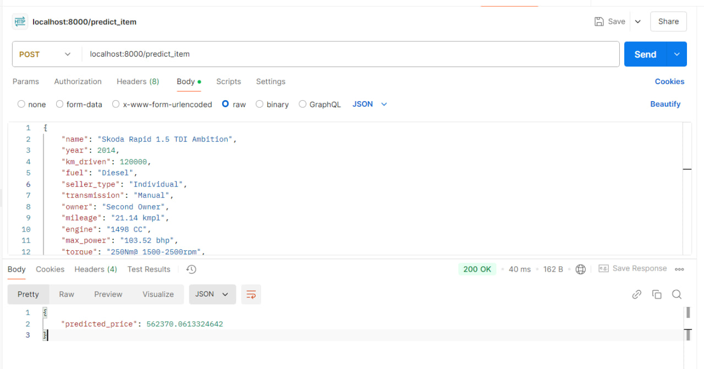

# Отчет

## EDA и preprocessing
В работе приведен базовый EDA с преобразованием признаков:
- miliage(str) to float
- engine(str) to int
- max_power(str) to float
- torque(str) to [torque', 'max_torque_rpm'] - float
- seats(float) to int
- name(str) to brand(str) - теперь более категориальный признак
А также заполнением пробелов медианой.

## Эксперименты с моделями

Были проведены эксперименты на моделях линейной регрессии. Посчитали наши бизнес-метрики на каждой из моделей и решили, какая из них лучше.
**Описание метрики:**
Среди всех предсказанных цен на авто нужно посчитать долю прогнозов, отличающихся от реальных цен на эти авто не более чем на 10% (в одну или другую сторону)
**Модели:**
- Классическая на численных признаках: 0.239
- Классическая на поскейленных численных признаках: 0.239
- Lasso: 0.239
- Lasso с кросс-валидацией и grid_search: 0.244
- ElasticNet: 0.244
- Ridge с категориальными признаками: 0.305

Наилучшей моделью оказалась модель Ridge, которую мы и использовали для нашего сервиса. В ней мы не скейлили никакие данные.

## Скрины работы сервиса

